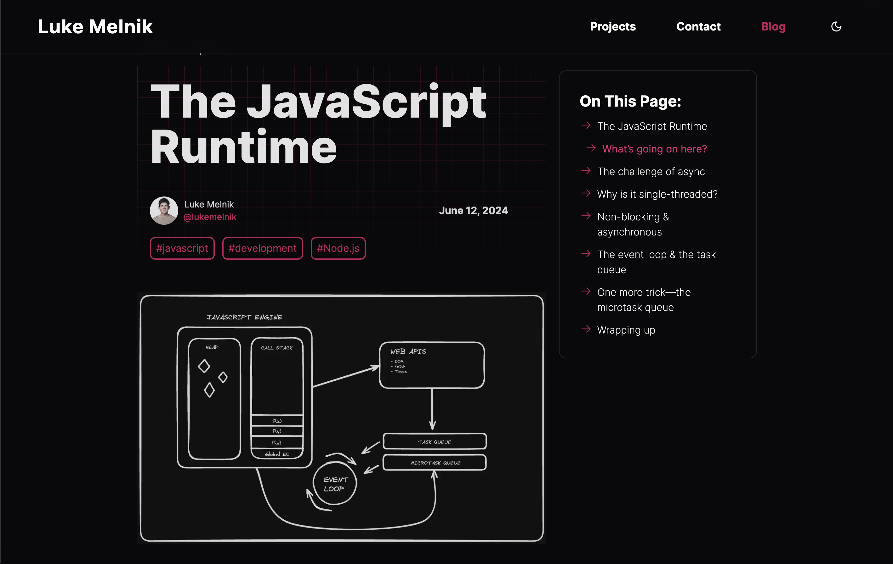

# Portfolio V1

[](https://lukemelnik.com)

The first iteration of my portfolio site. I learned (and keep learning) a lot from this project:

- Built the full site, with an MDX-based blog. Used the Node file system module, parsed frontmatter, and added custom React components including a table of contents with useEffect and the Intersection Observer API.
- Used static rendering in Next.js to deliver pages extremely quickly from the Cloudflare CDN.
- Gained a clear understanding of the difference between SSG, ISR, SSR and CSR rendering strategies.
- Optimized images to fix layout shift, correctly compressing and resizing.
- Used a VPS & Coolify to host the site. Set up automatic deployments and learned critical concepts about reverse proxies (Caddy), Docker, and DNS. Used security hardening measures, locking down unused ports with a firewall.
- Improved accessibility and performance Lighthouse score from 85 to 97+

---

## [Visit The Live Site](https://lukemelnik.com)

## Installation

1. Clone the repo:

```
git clone git@github.com:lukemelnik/portfolio-website-v1.git
```

2. Install dependencies:

```
npm install
```

3. Start the development server:

```
npm run dev
```

## Tech used

React, Next.js, Node.js, TailwindCSS, Shadcn, MDX, Resend, Coolify, Hetzner VPS, Docker, Cloudflare
